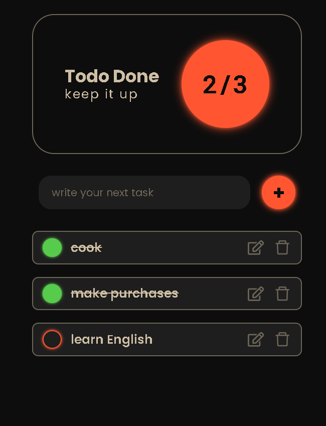

# Small applicaton "Todo App"

This is my first application using React JS + TypeScript.

## Table of contents

- [Overview](#overview)
  - [Information](#information)
  - [Screenshot](#screenshot)
  - [Links](#links)
- [My process](#my-process)
  - [Built with](#built-with)
  - [What I learned](#what-i-learned)

## Overview

### Information

This is a simple application for recording your tasks that will never lose its relevance. You can edit your task and delete it. After reloading the page, the data is not deleted.

### Screenshot

### Links

- [Live Site URL](https://todo-app-red-black.netlify.app/)

## My process

### Built with

- React JS
- react-icons
- TypeScript
- vite

### What I learned

Using React hooks useState(), useRef(), using TypeScript, saving data in localstorage, connecting and using react-icons.

